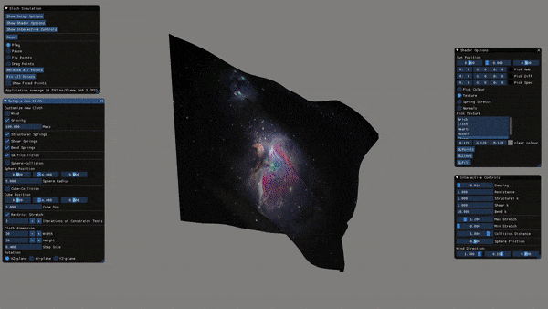

# S-Loth
A simulated cloth application



## Sources
* The underlying system is based on Bartek's particle system: [Bartek's Coding Blog](https://www.bfilipek.com/2014/03/three-particle-effects.html)
* For the cloth simulation, the particle system was extended based on two cloth tutorials:
  * [Matt's Webcorner](https://graphics.stanford.edu/~mdfisher/cloth.html)
  * [Moosegard's Cloth Simulation](https://viscomp.alexandra.dk/?p=147)
* [ImGui](https://github.com/ocornut/imgui)
* Textures were taken from [Unsplash](https://unsplash.com)
  
## Setup
To run the application, you need:
* FreeGLUT
* OpenGL
* GLEW
* SOIL

After cloning the repo, change directory into it:
```
cd S-Loth/
```

Then, create the build directory and open it:
```
mkdir build
cd build/
```

Run cmake, and press 'c' until the option "generate" appears, then press 'g'.
If errors occur, please check for the install location of the listed requirements.
CMake locates them with find-scripts in the subfolder cmake/
```
ccmake ..
```

After generating the project, run:
```
make install
```

Then, change directory to install/bin:
```
cd ../install/bin/
```

And run the application:
```
./s-loth_main
```

## Controls
In the application:
* press 'w' to move forwards
* press 's' to move backwards
* press space to stop all movement
* press left mouse button and move mouse to look around
* play around with all the gui options!


## Windows install (in-progress)
* TODO: add thirdparty dependencies in separate folder
* TODO: set libraries and include directories in CMake script
* TODO: install .dll files, textures, and shaders with CMake